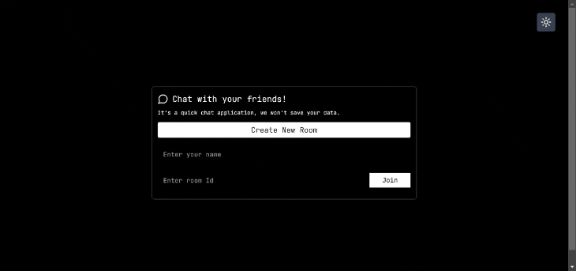
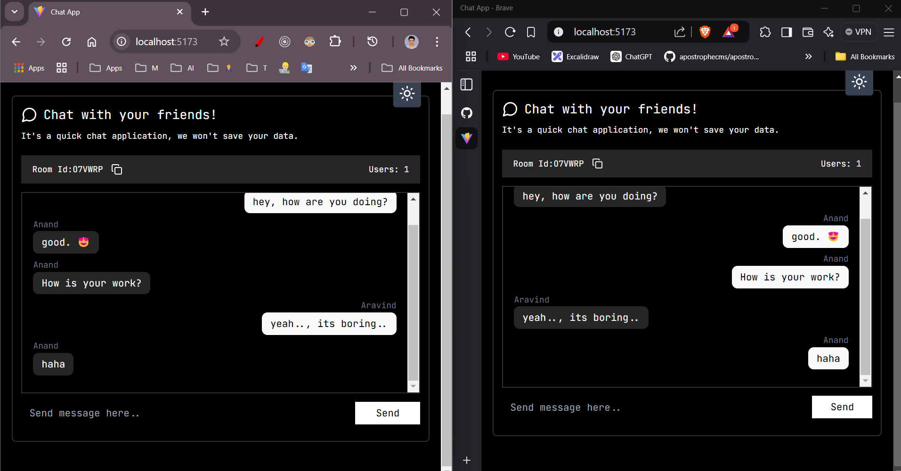

# 🗨️ Real-Time Chat App

A **real-time chat application** built with **WebSockets** that allows users to create and join rooms, share the room ID with friends, and chat seamlessly. The application is **fully responsive**, supports **dark mode**, and provides a smooth user experience.

---

## 🎥 Demo

📌 **GIF Preview:**  


📌 **Screenshot:**  


---

## 🚀 Features

✅ **Create a Room:** Users can generate a unique Room ID.  
✅ **Join a Room:** Enter a Room ID to join an existing chat.  
✅ **Real-Time Messaging:** Chat with friends in real-time using WebSockets.  
✅ **Dark Mode Support:** Seamless light/dark theme switching.  
✅ **Fully Responsive:** Works on all devices (mobile, tablet, desktop).  
✅ **Smooth UI & Notifications:** Built with Tailwind CSS, React-Hook-Form, React-Hot-Toast for a great user experience.  

---

## 🛠️ Tech Stack

### **Frontend**
- ⚡ TypeScript
- ⚛️ React
- 🎣 React Hook Form
- 🎨 Tailwind CSS
- 🔥 React Hot Toast
- 🔷 Lucide React (Icons)

### **Backend**
- ⚙️ TypeScript
- 🌐 WebSockets (WS)

---

## 📂 Project Setup

### **Frontend Setup**

```bash
# Clone the repository
git clone https://github.com/your-username/chat-app.git
cd chat-app/frontend

# Install dependencies
npm install

# Start the development server
npm run dev
```

### **Backend Setup**

```bash
cd chat-app/backend

# Install dependencies
npm install

# Start the WebSocket server
npm run dev
```

---

## 📌 How to Use

1️⃣ **Create a Room:** Click on "Create Room" to generate a unique Room ID.  
2️⃣ **Share Room ID:** Copy and share the Room ID with your friends.  
3️⃣ **Join a Room:** Enter the Room ID in the "Join Room" field and start chatting.  
4️⃣ **Enjoy Real-Time Messaging!** 🚀


